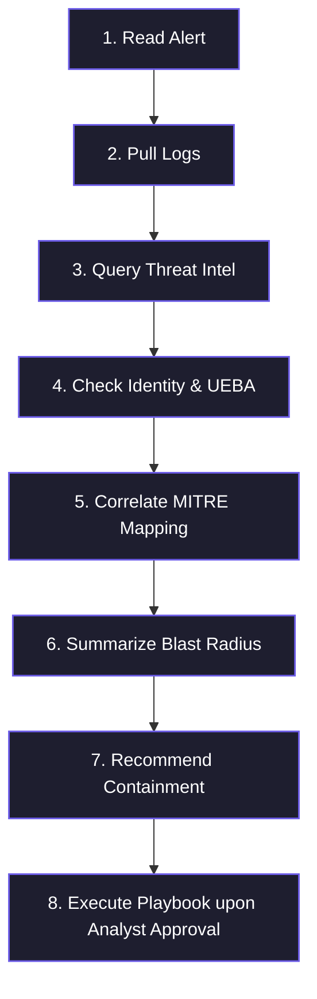
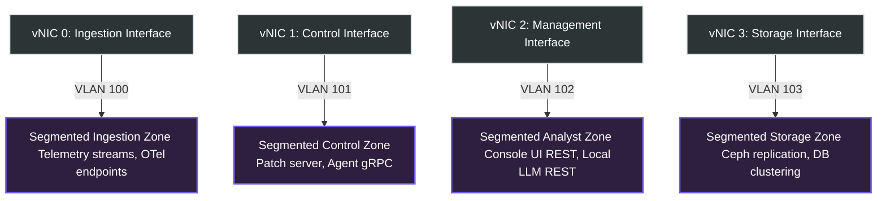

# Unified SecOps Platform – Technical & Functional Requirements Specification

## 1. Executive Summary & Philosophy

The **Unified SecOps Platform** represents a paradigm shift from traditional, siloed security tools toward a single, cohesive, **AI-native security operations platform and autonomous SOC**. Designed to insulate enterprise environments from public cloud security risks, Vendor Risk Management (VRM) overhead, unexpected operational costs, data jurisdictions, and complex cross-border compliance audits (DORA, GDPR, ECB), the entire platform is packaged and deployed as an on-premises **Private Cloud Unified SecOps VM Appliance**.

### 1.1 Private VM Appliance Packaging
*   **Virtual Appliance Delivery**: Packaged in standard virtual machine formats:
    *   **OVA/OVF** (for VMware ESXi and Type 1 vSphere environments).
    *   **VHDX** (for Microsoft Hyper-V Server).
    *   **QCOW2** (for enterprise KVM / OpenStack environments).
*   **Hardened Base OS**: Pre-installed on a stripped, hardened Enterprise Linux base (e.g., Rocky Linux Core or RHEL Core) running containerized, fully air-gapped runtimes (Docker Compose / local K3s).

---

## 2. Component 1: Main Unified SecOps Platform (Air-Gapped)

The central platform operates on-premises under strict air-gapped constraints, offering unified ingestion, analytics, an autonomous agent core, and native case management.

### 2.1 Ingestion & Cross-Cloud Lakehouse Data Marts
* **OpenTelemetry-Centric Ingestion Pipeline**:
  * Standardizes on **OpenTelemetry (OTel) collectors** as the default ingestion pipeline to lower telemetry acquisition costs, remove vendor lock-in, and standardize log formatting.
  * Optimized for modern infrastructure: Cloud, Kubernetes, Microservices, and DevSecOps topologies.
* **Pluggable Data Marts & OOTB Defaults**:
  * The platform provides **Provisioned-by-Default Data Marts** in the active ClickHouse core:
    1. **Legacy Telemetry Mart**: Normalized via `LegacyTel` parser adapters for IBM/HPE systems.
    2. **Windows Telemetry Mart**: Optimized for Active Directory, Windows Event Logs, and Sysmon.
    3. **Linux Telemetry Mart**: Configured for Syslog, `auditd`, and raw eBPF traces.
    4. **Firewall Telemetry Mart**: Optimized for multi-tenant firewall configurations and network flows (IPFIX/NetFlow).
    5. **Proxy Telemetry Mart**: Optimized for egress web proxies, gateway headers, and DNS requests.
    6. **Identity & Governance Mart**: Structured for SSO logs, MFA challenges/verifications, and external IGA recertification events (SailPoint/Saviynt).
  * **Dynamic Provisioning Engine**:
    * Administrators can dynamically **Add (Register)** or **Remove (Deregister)** custom technology data marts (e.g., creating a `workday` mart or an `oracle_db` mart) via the central console UI without system restart.
    * Registration automatically provisions a new ClickHouse partition table and hot-reloads the OTel stream routing mappings in memory.
* **Virtual Entity Demultiplexing & VM-Application Instance Mapping**:
  * To solve the problem of OS log duplication and blurry boundaries when a single Virtual Machine (VM) hosts multiple distinct applications, the ingestion pipeline implements a **Virtual Entity Demultiplexing Engine**.
  * The lakehouse schema maps a unique, composite entity identifier:
    $$\text{Virtual Entity ID} = [\text{Hypervisor Type}] + [\text{Host VM UUID}] + [\text{Application Instance ID}]$$
  * When OS logs and host telemetry are ingested, the demultiplexer maps them individually to each active Application Instance.
  * **Dashboard Representation**: In the central console's interactive node maps, a single physical/virtual server hosting 5 different applications (e.g., Workday, Oracle, SQL, Autobahn, Tanium) is represented as **5 distinct, isolated Virtual Entity Nodes**. Alerts, blast-radii, and playbooks are targeted specifically at the affected virtual entity rather than flooding the host OS record with duplicate, overlapping logs.
* **Ingestion Event Types Mapping**:
  * The ingestion pipeline natively normalizes and parses the **27 Standardized Event Types** (including successful/failed logons, configuration controls, privilege accesses, and system status updates).
  * The detailed field mappings (User ID, Email, Source/Destination IPs, Hosts, and Application context) and raw telemetry mappings are defined in the companion **[siem_event_schema.md](siem_event_schema.md)** blueprint.

### 2.2 Security Data Lake & Active Search
* **180-Day Active Search Window**: Columns, indices, and partitions are optimized in a high-speed ClickHouse core to deliver sub-second search latencies for the first 180 days.
* **Detection & Behavior Engine**:
  * Combines stateful **Detection-as-Code** rules (Sigma and YARA-L) with integrated **UEBA** anomaly models to discover baseline deviations without manual rule configuration.
  * Provides out-of-the-box (OOTB) threat correlation engines mapping multi-domain data marts (Active Directory, Proxy, Firewall, Workday, Tanium, Oracle DB, SQL, Autobahn, Terminal Emulation).
  * The precise correlation rules, detection logic, and custom AI Agent investigation workflows for core threats (including **Account Takeover, Brute Force, Short-lived Accounts, Password Spraying, Login after Offboarding, and Suspicious Lockouts**) are detailed in **[threat_detection_use_cases.md](threat_detection_use_cases.md)**.

### 2.3 Security AI Agents & Autonomous Workflows
The platform implements autonomous **Security AI Agents** running locally. Upon receiving a security trigger or anomaly alert, the agent executes the following **8-Step Autonomous Investigation Workflow**:



* **Workflow Detail**:
  1. **Read Alert**: Detects anomalies or rule triggers across any active data mart.
  2. **Pull Logs**: Automatically queries historical and surrounding logs across multiple data marts to build correlation timelines.
  3. **Query Threat Intel**: Matches IOCs (IPs, hashes, domains) against local self-hosted threat intelligence databases (TIP).
  4. **Check Identity & UEBA**: Queries Active Directory, OAuth providers, or identity data marts, checking for UEBA behavioral baseline anomalies on affected users/devices.
  5. **Correlate MITRE Mapping**: Maps behaviors directly to the **MITRE ATT&CK** framework matrix.
  6. **Summarize Blast Radius**: Traces active communication paths, host connections, and access tokens to outline exactly what systems are exposed.
  7. **Recommend Containment**: Suggests highly targeted containment recommendations (e.g., firewall block, user disablement, or host isolation).
  8. **Execute Playbook**: Triggers the native SOAR automation playbook immediately upon receiving **Analyst Approval**.
* **Automated Triage & False Positive Closing**: AI agents automatically triage low-severity alerts, correlate noise, and close verified false positives, leaving clean, context-rich alerts for analysts.

### 2.4 Native Case Management & Ticketing
* Natively provides incident ticketing, team canvas, checklist tracking, and audit trails without requiring external ticketing suites.

### 2.5 Central Control Console
* **Unified Administrative UI**:
  * Administrators can directly manage, monitor, and configure the Patch & Deployment Server from the Main SecOps console.
  * Features a **Vulnerability & Update Center** to inspect real-time system vulnerabilities, track patch status, and execute fleet-wide agent and platform upgrades.

---

## 3. Component 2: Lightweight Telemetry Agents & OTel Legacy Adaptation
* **Modern Systems**: Native OTel collectors deployed on Windows, Linux, and macOS.
* **Expanded Application & Network Device Monitoring**:
  * Lightweight agents actively hook into local applications (parsing process logs, tracing system calls, auditing config edits).
  * Feature an integrated **Network Device Syslog & SNMP Trap Listener** to ingest telemetry from local routers, switches, and firewalls, acting as local collectors in air-gapped subnets.
* **Hypervisor Virtualization Context**:
  * Agents automatically audit their host configuration to identify and tag the **Hypervisor Type**:
    *   **Type 1 (Bare-Metal)**: Dedicated hypervisors running directly on hardware (e.g., VMware ESXi, Microsoft Hyper-V Server, KVM).
    *   **Type 2 (Hosted)**: Hypervisors running on top of a host OS layer (e.g., VMware Workstation, Oracle VirtualBox, UTM).
  * This tagging is bound directly into every telemetry packet, ensuring the central Lakehouse has full hypervisor infrastructure context.
* **Legacy Systems Innovation (AS/400, z/OS, HPE NonStop)**:
  * Since native OTel support for legacy systems is historically immature, the agent architecture uses **`LegacyTel`** as an innovative bridging agent.
  * It translates proprietary AS/400 QAUDJRN streams, mainframe SMF tables, and HPE NonStop EMS logs into OTel-compatible telemetry streams, delivering a single, standardized ingestion pipeline for the whole enterprise.

---

## 4. Component 3: Patch & Deployment Server (with Vulnerability Scanner)

The control plane responsible for vulnerability assessments, software updates, configuration management, and execution of cryptographic updates across the fleet.

### 4.1 Built-in Vulnerability Scanner
* **Endpoint Dependency & Vulnerability Auditing**:
  * Continuously parses agent host system packages, active libraries, and configurations to perform vulnerability assessments against a localized, air-gapped vulnerability database (e.g., matching local CVE mappings).
  * Automatically audits main platform modules, databases, and dependencies for security compliance and exposes findings to the central dashboard.

### 4.2 Centralized Patching & Upgrade Orchestration
* **Console-Triggered Upgrades**:
  * Security administrators can select targets (specific agent clusters, modern operating systems, legacy systems, or central platform microservices) and trigger updates directly from the main SecOps platform console.
  * Communicates update payloads over highly efficient, secure gRPC control streams.
* **Cryptographic Patch Integrity**:
  * Leverages a strict **Dual-Signature verification model** where all binary packages and patches must be cryptographically signed using an offline trusted public/private key framework.
  * Agents verify the package signature locally before execution. Compromise of the deployment server will NOT allow rogue updates to run on endpoints.
* **Automated Staged Rollouts & Rollbacks**:
  * Progressive rollout cycles (e.g., canary groups) with automatic rollback to the cached stable binary if endpoint communications or checks fail.

---

## 5. Component 4: Data Archive & Cold Storage

### 5.1 5-Year Cold Archival & Audit Compliance
* **Complete Alert & Event Auditing**:
  * When an alert is archived, the platform does not merely store the alert summary. It encapsulates the **entire underlying raw telemetry events** associated with the incident in a single audit package.
  * Stores these packages in compressed columnar Apache Parquet format on local object storage for **5 years**.
  * Guarantees compliance for deep forensic audits years after an incident.

---

## 6. Security, Privacy & PII Access Controls

### 6.1 Supervisor-Approved 24-Hour PII Access
* All database tables mask personal user information by default.
* Raw PII is temporarily unmasked only after supervisor approval in the native ticketing system, automatically resetting back to a masked state after a strict **24-hour expiration**.

### 6.2 Appliance Self-Monitoring, Privilege & Break-Glass Auditing
To satisfy rigorous regulatory compliance (DORA, GDPR, ECB) and prevent insider threat or host-level compromise, the private VM appliance actively **monitors, logs, and audits itself** under a zero-trust model:

#### 6.2.1 GUI (Graphical User Interface) Self-Monitoring
*   **Web Console UI Auditing (Next.js/React)**:
    *   Every user interaction in the central administrator console is intercepted at both the frontend application router and the API Gateway.
    *   **Monitored Elements**:
        *   User authentication attempts, sessions, and multi-factor validation states.
        *   Administrative dashboard navigation paths, query parameters, and export requests.
        *   Database operations, configuration alterations, custom data mart registrations/deregistrations.
        *   Patch trigger execution, canary rollouts, and deployment adjustments.
        *   Incident case ticket status adjustments, evidence pins, and SOAR manual overrides.
    *   **Audit Payload Signature**: Every logged GUI action attaches: `[UTC Timestamp] + [User ID] + [Active Role] + [Source IP (Analyst Station)] + [Session Token Hash] + [Action Category] + [Request Payload Digest]`.

#### 6.2.2 Non-GUI (System & Console) Self-Monitoring
*   **CLI and Shell Session Recording**:
    *   Monitors all direct console TUI interfaces, local virtual serial terminals (vSockets), SSH logins, and local interactive sessions.
    *   Utilizes a local hardened **audit daemon (`auditd`)** and shell-level wrappers to track command history, keystrokes, and executed binaries.
*   **Privileged System Operations**:
    *   Intercepts and logs every `sudo` execution, privilege elevation attempt, and kernel module alteration (`insmod`/`rmmod`).
    *   Tracks systemd service states, file integrity checks of secure `/etc` configs, container daemon activities (Docker/K3s API requests), and raw DB operations bypassed directly via raw command-line utilities.
*   **Telemetry Loops**:
    *   An isolated, low-overhead system monitoring service (local OpenTelemetry wrapper) runs on the host loopback network interface, pumping host logs and stats into the ingestion queue of `vNIC 0`.

#### 6.2.3 Administrative Privilege Access Monitoring (PAM)
*   **Role-Based Privilege Gateways**:
    *   All privileged actions require authenticated privilege tokens generated natively within the IAM module.
    *   Privileged accesses are tied back to the Identity & Governance Mart, checking active SailPoint/Saviynt governance clearances.
    *   Attempts to execute administrative commands without an active, verified governance certification trigger a high-severity alert and alert the SOC immediately.

#### 6.2.4 "Break-Glass" Emergency Recovery Protocol
Under extreme operational crisis scenarios (e.g. total physical network isolation, identity service outages, active ransomware containment lockout), authorized users can invoke the **"Break-Glass" Emergency Protocol**:
*   **Break-Glass Triggers**:
    *   *Console Recovery Shell*: Direct keyboard/mouse physical console connection bypasses external LDAP/AD identity servers using a localized physical cryptographic token.
    *   *PII Unmasking Bypass*: Bypassing supervisor approvals for emergency unmasking of raw PII during active high-priority forensic threat hunts.
    *   *Patch Override*: Forcing local, unsigned updates or configurations to recover system modules during critical failures.
*   **The Break-Glass Enforcement Workflow**:
    ```mermaid
    sequenceDiagram
        autonumber
        actor Admin as Security Admin
        participant Appliance as Appliance Recovery Console
        participant LocalLogs as Hardened Local Logs (WORM)
        participant M4 as Module 4 Archive Storage
        participant Alert as Extreme-Severity Broadcast

        Admin->>Appliance: Invoke Break-Glass Mode
        Note over Appliance: Prompts for Local Recovery Key & Justification
        Admin->>Appliance: Provide Recovery Key & Operational Justification
        Appliance->>LocalLogs: Write Immutable Log (WORM local file system)
        Appliance->>M4: Stream Log to Ceph Archive (WORM W-Once Lock)
        Appliance->>Alert: Broadcast Extreme-Severity System Alert
        Appliance->>Admin: Grant Ephemeral Root Shell (2-Hour Hard Limit)
        Note over Appliance: Automatic Session Termination after 120 minutes
    ```
*   **Tamper-Proof Log Lock (WORM Policy)**:
    *   The instant a Break-Glass override is triggered, the platform generates a unique, digital-signature cryptographically chained log record.
    *   **Log Record Structure**: Captures the exact physical terminal port (e.g. tty1), hardware serial ID, raw inputs, system keystrokes, active time period, and the operator's typed justification.
    *   **Write-Once, Read-Many Execution**: Written instantly to a local, kernel-protected write-only directory block, and simultaneously transmitted over `vNIC 3` directly to a WORM-locked bucket on the **Module 4 cold storage Ceph array**.
    *   **Immutability Guarantee**: These emergency log paths bypass standard service layers and cannot be modified, deleted, or overridden by any administrative credential or root user account. They provide an absolute, untamperable audit trail for post-incident regulatory reviews.

---

---

## 7. Zero Trust & Identity Threat Detection (ITDR) Architecture

To operate in modern threat landscapes, the entire four-module system is designed under a strict **Zero Trust paradigm ("Never Trust, Always Verify")**:

### 7.1 Zero Trust Network Access (ZTNA) Agent Boundaries
*   **No Network-Based Trust**: Agents are never trusted based on local network subnets, VPN sessions, or physical datacenter presence.
*   **Continuous Cryptographic Authentication**: All telemetry and control plane traffic requires continuous **mTLS v1.3** validation. Telemetry is dropped instantly if unique cryptographic device signatures or certificates are missing or expired.
*   **Least-Privilege Token Authorization**: Configuration pushes and vulnerability queries are bound by ephemeral, least-privilege tokens. An agent can never request logs or administrative controls from another agent or the main platform.

### 7.2 Zero Trust control Plane (Deployment Isolation)
*   **Isolated Deployment Domain**: The Patch & Deployment server acts as an isolated operational silo. The main platform never trust the deployment server to perform direct, unvalidated command executions.
*   **Dual-Signature Enforcement**: Binary patches pushed from the deployment control plane are treated as hostile by endpoints until their **dual cryptographic signatures** (offline developer key + admin keys) are verified locally. Compromise of the deployment server will NOT allow an attacker to execute malicious modifications on modern or legacy systems.

### 7.3 Identity Threat Detection & Response (ITDR)
*   **Entitlement to Access Correlation**: The detection engine continuously correlates Active Directory/SSO authentication sessions with **Identity Governance & Administration (IGA)** platforms (SailPoint/Saviynt).
*   **Just-in-Time Verification**: When a user account accesses a sensitive data mart (e.g., executing a database query in the Oracle DB Mart), the engine queries the Identity Governance Mart to confirm that a current, certified entitlement exists. If the entitlement has expired, or is decertified, an immediate privilege misuse alert is triggered and a containment SOAR playbook blocks active session tokens.

---

## 8. Network Segmentation & High Availability (HA) Appliance Specification

To guarantee business continuity, data protection, and flawless air-gapped on-premises operational continuity, the private VM appliance implements strict network segmentation and dual-host high availability failover.

### 8.1 Segmented Network Architecture (Dynamic Virtual NICs)
The VM Appliance separates system operations by exposing four dedicated virtual network interfaces (vNICs) mapped to separate VLANs on the physical host hypervisor:



1.  **vNIC 0 - Ingestion Interface (VLAN 100)**: Strictly dedicated to receiving inbound OTel telemetry (mTLS) from lightweight agents and syslog network concentrators. Isolated from the administrative dashboard.
2.  **vNIC 1 - Control Interface (VLAN 101)**: Reserved for the Patch & Deployment server. Receives bi-directional gRPC connections from endpoints.
3.  **vNIC 2 - Management & Analytics Interface (VLAN 102)**: The only interface accessible by security analysts and supervisors. Hosts the React Console UI and private API gateways for the self-hosted AI Copilot.
4.  **vNIC 3 - Storage & Replication Interface (VLAN 103)**: An isolated network dedicated to inter-node ClickHouse replication, Ceph/MinIO storage cluster synchronization, and cold storage exports.

### 8.2 Component High Availability (HA) & Failover Matrix

The appliance ensures complete redundancy for all core components to prevent any single point of failure:

| Module / Component | Primary Operational Mode | HA Failover Mechanism | Recovery Objective (RTO) |
| :--- | :--- | :--- | :--- |
| **Module 1: Ingestion & In-Memory SOAR** | Active-Active Container Nodes | Stateless containers are distributed across multiple virtual nodes, load-balanced by **HAProxy / Keepalived** utilizing a Virtual IP (VIP). If a node fails, traffic dynamically shifts. | $< 2\text{ seconds}$ (Transparent to agents) |
| **Module 1: Warm Storage (ClickHouse)** | ClickHouse Keeper Cluster | Employs synchronous replication across physical hosts with multi-master setups. If Node A fails, Node B continues serving query traffic natively. | $0\text{ seconds}$ (No query loss) |
| **Module 2: Lightweight Telemetry Agents** | Active Client Agent | Agents are configured with dual OTel collection targets (Primary VIP vs Secondary VIP). If connection to the Primary fails, the agent immediately spool-buffers logs on disk and redirects to the Secondary. | $0\text{ seconds}$ (Data buffered on-disk) |
| **Module 3: Patch & Deployment Server** | Active-Passive HA Pair | Deployment servers run in an Active-Passive pair with a shared **Virtual IP (VIP)**. Configurations and signed packages are synchronized via local clustered databases. | $< 5\text{ seconds}$ (Stateful gRPC reconnection) |
| **Module 4: Cold Archive Storage** | Distributed Ceph Cluster | Standard on-premises Ceph Object Storage with **Erasure Coding ($3+2$ configuration)**. Allows complete loss of up to 2 physical storage drives/nodes without data corruption. | $0\text{ seconds}$ (Self-healing storage arrays) |
