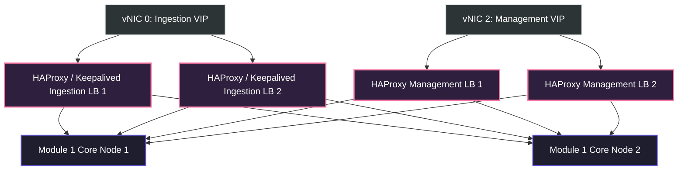

# Unified SecOps Platform – Hardware Sizing & VM Configuration Blueprint

This document details the production-grade VM configurations, load balancing architecture, UAT/Dev server specifications, and physical bare-metal hardware recommendations required to host the Unified SecOps Platform VM Appliance under strict air-gapped on-premises parameters.

---

## 1. Production VM Configuration Matrix

To deliver sub-second search latencies on the warm ClickHouse cluster, real-time SOAR playbooks execution, high-density telemetry ingestion, local GPU-accelerated AI Copilot inference, and resilient 5-year cold storage, the following virtual machine configurations are required.

All VMs are to be provisioned on **Type 1 Hypervisors** (VMware ESXi, Hyper-V, or KVM) with reserved resources (no CPU/RAM overcommit).

### 1.1 VM Allocation Details

| VM Role / Module | Instance Count | vCPU (Reserved) | RAM (Reserved) | Storage Configuration | Network Interfaces (vNICs) | Notes / HA Mode |
| :--- | :---: | :---: | :---: | :--- | :--- | :--- |
| **Ingestion & Management Load Balancer** | 2 | 4 Cores | 8 GB | 60 GB NVMe (OS) | `vNIC 0` (Ingestion) `vNIC 2` (Management) | **Active-Active** Keepalived + HAProxy VRRP VIP. Handles L4/L7 routing. |
| **Module 1: Unified Core & Ingestion** | 2 | 16 Cores | 64 GB | *   100 GB NVMe (OS) *   500 GB NVMe (ClickHouse Hot Cache) | `vNIC 0` (Ingestion) `vNIC 2` (Management) `vNIC 3` (Storage) | **Active-Active** stateless ingestion and app services. ClickHouse Keeper for clustering. |
| **Module 1: AI Copilot Inference Node** | 1 | 8 Cores | 32 GB | *   100 GB NVMe (OS) *   200 GB NVMe (Model Weights) | `vNIC 2` (Management/LLM API) | **Active-Standby**. Requires **PCIe GPU Pass-through** (1x NVIDIA L4 or L40S GPU). |
| **Module 3: Patch & Deployment Server** | 2 | 8 Cores | 16 GB | *   100 GB NVMe (OS) *   1 TB SSD (Package/Patch Repository) | `vNIC 1` (Control) `vNIC 2` (Management) | **Active-Passive** HA pair synchronized via local clustered DB, fronted by Keepalived VIP. |
| **Module 4: Cold Archive Ceph Node** | 3 | 8 Cores | 32 GB | *   100 GB SSD (OS) *   2x 480 GB SATA SSD (Ceph Journal) *   6x 8 TB SAS HDD (Ceph OSD Data) | `vNIC 3` (Storage) | **Distributed Cluster**. Erasure Coding ($3+2$ configuration) across the 3 nodes. |

---

## 2. Load Balancing & Network VIP Architecture

To guarantee absolute operational continuity across the air-gapped segmented network, dedicated Load Balancing layers front the critical entry points of the appliance.

### 2.1 Layer 4/7 Load Balancing Strategy
*   **Virtual IP (VIP) Allocation**:
    1.  **Ingestion VIP (`10.100.0.100` on VLAN 100)**: Binds to `vNIC 0`. Lightweight telemetry agents connect to this VIP via mTLS on port `443` (OTel Protobuf). HAProxy distributes connections round-robin across active Module 1 Ingestion nodes.
    2.  **Deployment VIP (`10.101.0.100` on VLAN 101)**: Binds to `vNIC 1`. Telemetry agents connect via secure gRPC on port `50051` for configurations and patch retrieval.
    3.  **Management VIP (`10.102.0.100` on VLAN 102)**: Binds to `vNIC 2`. Security analysts connect via HTTPS on port `443` to access the React/Next.js Console Dashboard UI.
*   **Session Persistence & Failover**:
    *   **Keepalived (VRRP)**: Assures instant ARP-level VIP handover ($< 1.5\text{s}$) if a primary load balancer VM fails.
    *   **HAProxy health checks**: Actively polls `https://[Module_1_Node]/health` and dynamically drops unhealthy backend nodes from the active pool in less than 2 seconds.

---

## 3. Dedicated UAT & Development Server Configurations

To facilitate testing, staging, and sandboxing, UAT and Development environments are isolated on dedicated, resource-constrained VMs. These environments consolidate modules onto single hosts to conserve hardware footprints.

### 3.1 Common UAT Environment (Staging)
The UAT environment mimics the production software architecture but runs on a single high-performance VM, allowing full integration testing and upgrade validation before pushing updates to production.

*   **vCPU**: 16 Cores (Reserved)
*   **RAM**: 64 GB (Reserved)
*   **Storage Configuration**:
    *   100 GB SSD (OS & App Services)
    *   300 GB NVMe (Staging ClickHouse warm storage)
    *   1 TB HDD (Staging Archive Storage - simulated Ceph directory)
*   **GPU pass-through**: Optional (Runs Local LLM on CPU with higher latency if GPU is omitted).
*   **Network Config**: Single vNIC with virtual sub-interfaces to simulate VLAN 100-103 network boundaries.

### 3.2 Common Development Server (Sandbox)
The Development environment is highly streamlined, focused on log parser adjustments, SOAR playbook drafting, and custom data mart registration testing.

*   **vCPU**: 8 Cores (Shared/Overcommit allowed)
*   **RAM**: 32 GB
*   **Storage Configuration**:
    *   200 GB SSD (Consolidated OS, ClickHouse development schema, and Git repositories)
*   **GPU pass-through**: None (AI Copilot runs in mock response mode for code testing).

---

## 4. Recommended Bare-Metal Host Hardware

To host the complete set of virtual machines (Production, UAT, and Dev), a highly resilient, dual-socket physical server configuration is recommended. 

To achieve high availability at the physical layer, we recommend **two identical physical servers** configured as a clustered hypervisor pool (e.g. VMware vSphere HA Cluster or clustered Proxmox VE).

### 4.1 Physical Server Hardware Specification (Per Host - Dual Node Cluster)

| Hardware Component | Production Specification | Rationale & Selection Criteria |
| :--- | :--- | :--- |
| **Chassis** | Enterprise 2U Rackmount Server (e.g., Dell PowerEdge R760 or HPE ProLiant DL380 Gen11) | Provides required PCIe slots for GPU integration and front-accessible drive bays for storage arrays. |
| **Processor (CPU)** | Dual (2) AMD EPYC 9354 Processors (32 Cores, 64 Threads per CPU, 2.7GHz Base Clock) | Total of 64 Cores / 128 Threads per physical host. Necessary to support reserved vCPU configurations for clustered database engines, agents concentrators, and parallel analytics. |
| **Memory (RAM)** | 512 GB DDR5 SmartMemory (8x 64GB RDIMMs, 4800MT/s) | Delivers high bandwidth for in-memory ClickHouse aggregations and parallel Local LLM operations. |
| **Storage Controller** | Enterprise SAS/SATA/NVMe RAID Controller with 8GB Cache and CacheVault Battery Backup | Guarantees hardware-level disk redundancy and prevents data corruption during physical power anomalies. |
| **Warm/Hot Storage Drives** | 4x 1.92TB Enterprise NVMe PCIe Gen4 SSDs (Configured in RAID 10) | Delivers ~3.8TB of high-speed active storage. Provides massive IOPS required for sub-second search latencies on the 180-day warm database. |
| **Cold Storage Drives** | 8x 8TB SAS 12Gbps 7.2K RPM HDDs (Configured in RAID 6) | Delivers ~48TB of on-premises storage. Used for direct hosting of cold Parquet files if Ceph is virtualized on local hypervisor storage. |
| **Inference Accelerator (GPU)** | 1x NVIDIA L40S PCIe GPU (48GB GDDR6 memory) OR 2x NVIDIA L4 GPUs (24GB GDDR6 each) | Supports high-throughput, low-latency local inference of 7B to 8B parameter Local LLMs (Llama-3-Instruct / Mistral-Instruct) in an air-gapped configuration. |
| **Network Interfaces** | *   1x Dual-Port 25GbE SFP28 PCIe NIC (Intel E810) *   1x Quad-Port 1GbE RJ45 Base-T LOM | *   **25GbE Ports**: Redundant uplink trunks carrying tagged VLAN 100-103 traffic to core switches. *   **1GbE Ports**: Out-of-Band Management (iDRAC/iLO) and secondary hypervisor heartbeat. |
| **Power Supplies** | Dual (1+1 Redundant) 1600W Hot-Plug Titanium Power Supplies | Ensures power redundancy across separate server racks/UPS sources. |
| **Warranty & Support** | 5-Year Mission Critical 4-Hour On-Site Support | Guarantees rapid hardware restoration for critical, regulated SecOps operations. |

---

## 5. Summary of Resource Overhead

Based on the recommended VMs configurations, the total resource footprint on the physical hypervisor hosts is mapped below, demonstrating comfortable headroom on our dual-node physical host cluster:

| Resource Type | Total VMs Allocation (Production) | Per-Host Physical Resource Capacity (Cluster Host) | Headroom / Oversubscription Status |
| :--- | :---: | :---: | :---: |
| **CPU Cores** | 68 Cores | 128 Threads | **No Oversubscription**. Safely maps within physical threads. |
| **System Memory** | 280 GB RAM | 512 GB RAM | **45% Free Capacity**. Allows dynamic scaling of database nodes. |
| **Storage Allocation**| ~3.5 TB SSD / 48 TB SAS | ~7.6 TB SSD / ~64 TB SAS | **Highly Scalable**. Front bays support dynamic storage additions. |
| **GPU Accelerators** | 1x GPU Allocation | 1x PCIe Accelerator slot | **Fully Provisioned**. |

---
