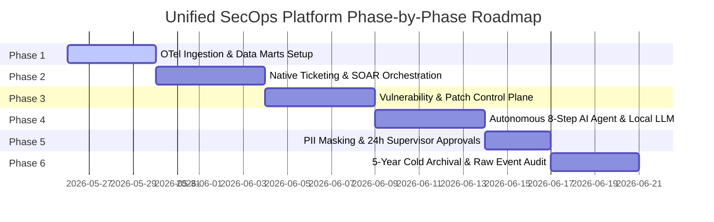

# Implementation Plan – Unified Security Operations Platform

This updated implementation plan details the strategy for designing and constructing the next-generation **AI-Native Unified Security Operations (SecOps) Platform**. It fully integrates your strategic vision of moving from legacy standalone suites to an autonomous, self-healing, and self-patching SOC.

---

## 1. Confirmed Strategic & Architectural Vision

Based on your design philosophy, the platform's core requirements are aligned on the following paradigms:
* **The Autonomous SOC Paradigm**: Replaces standard manual alert response pipelines with an agentic, loop-based model:
  $$\text{Alert} \longrightarrow \text{Security AI Agent} \longrightarrow \text{Autonomous Investigation} \longrightarrow \text{Remediation Recommendation} \longrightarrow \text{Analyst Approval}$$
* **Consolidated Suite**: Natively integrates **SIEM, SOAR, UEBA, TIP, XDR, Vulnerability & Patch Management, and Case Management** into a single software module, removing tool sprawl and reducing high engineering maintenance effort.
* **Unified OpenTelemetry Lakehouse**:
  * Employs standard **OpenTelemetry (OTel) collectors** across Cloud, Kubernetes, Microservices, and DevSecOps environments to standardize telemetry at a lower ingestion cost.
  * Extends OTel to legacy platforms (AS/400, z/OS, Tandem) via custom **`LegacyTel`** mappers to unify enterprise logging.
  * Organizes telemetry into specialized **Data Marts** (Legacy, Windows, Linux, Firewall, Proxy).
* **AI Agent Workflow (8-Step Execution Path)**:
  1. **Read Alert**: Monitors triggers and anomalies across all active data marts.
  2. **Pull Logs**: Queries correlation timelines across relevant data marts.
  3. **Query Threat Intel**: Matches IOCs against local threat databases.
  4. **Check Identity & UEBA**: Reviews Active Directory status and baseline behavioral anomalies.
  5. **Correlate MITRE Mapping**: Maps host and identity events directly to MITRE TTPs.
  6. **Summarize Blast Radius**: Evaluates exposure pathways and compromised connections.
  7. **Recommend Containment**: Formulates targeted host/user containment operations.
  8. **Execute Playbook**: Executes containment via native SOAR modules upon receiving **Analyst Approval**.
* **Deployment Control with Vulnerability & Patch Orchestration**:
  * Integrates a built-in **Vulnerability Scanner** within the Patch & Deployment Server to continuously audit endpoints, agents, libraries, and core platform modules against localized air-gapped CVE directories.
  * Enables administrators to trigger **remote software upgrades and security patches** directly from the **Main Console UI** to both lightweight agents and central platform modules.
  * Secures the upgrade pipeline using strict **cryptographic dual-signing trust validations** and automated canary rollbacks.
* **180-Day Active / 5-Year Cold Auditing**:
  * **180 Days Active**: Fast queries in ClickHouse columnar database.
  * **5 Years Cold**: Columnar Apache Parquet files containing **complete alerts along with all underlying raw events** to support forensic audits.
* **PII Privacy Controls**: Masked by default, with dynamic **Supervisor Approval** unmasking that automatically **expires and resets after 24 hours**.

---

## 2. Project Milestones

### Milestone 1: OpenTelemetry Ingestion & Specialized Data Marts
* Build the OTel ingestion pipeline supporting Cloud, Kubernetes, and local modern systems.
* Integrate the **`LegacyTel`** telemetry mapper for legacy hosts (AS/400, z/OS, Tandem).
* Build and partition specialized Data Marts in ClickHouse (Legacy, Windows, Linux, Firewall, Proxy).

### Milestone 2: Native Ticketing & SOAR Orchestration
* Code the native case management, ticketing lifecycle, and collaboration board.
* Write local playbooks to block firewall IPs, isolate endpoints, or suspend directory credentials.

### Milestone 3: Vulnerability Scanning & Console Patch Orchestration
* Develop the built-in Vulnerability Scanner backend to run checks on agent hosts and core platform modules using localized CVE definitions.
* Create the centralized **Vulnerability & Update Dashboard** in the Main Console.
* Program the gRPC patching pipeline allowing administrators to push cryptographically signed updates and hotfixes directly from the UI.

### Milestone 4: Autonomous 8-Step AI Agent Workflow
* Install and host the Local LLM inference server (vLLM/Ollama running Mistral/Llama) inside the air-gapped environment.
* Implement the core agent loop executing the **8-step investigation workflow** (log polling, identity/UEBA baseline checks, TIP lookup, MITRE mapping, blast radius analysis, and auto-recommendation).
* Enable automated false-positive triaging and closure features.

### Milestone 5: Masking, PII Approvals & Appliance Self-Monitoring
* Write ingestion filters to hash and mask direct user PII.
* Build supervisor request-approval modules in the native ticketing engine with automated **24-hour TTL session expiry**.
* Implement appliance self-monitoring interceptors capturing Next.js Web UI console operations (GUI) and host CLI shell command/keystroke execution via `auditd` (Non-GUI).
* Code the "Break-Glass" Emergency Bypass and local write-once log directory blocks, forwarding recovery serial session records directly to Module 4 Ceph cold storage.

### Milestone 6: 5-Year Cold Archival & Raw Event Audit Logs
* Write the data tiering daemon to compress active 180-day data into Apache Parquet.
* Ensure archives capture **both** alerts and all related underlying raw events.
* Implement the forensic replay hydration engine to restore historical partitions on demand.

---

## 3. Verification Plan

### Automated Tests
* **Vulnerability Scan Verification**: Trigger an automated scan against a mock agent package configuration and verify that vulnerabilities and compliance ratings are correctly identified and populated in the central schema.
* **Console Patch Execution**: Simulate a patch trigger from the main console API and verify the agent receives, cryptographically validates the dual signatures, applies the update, and reports the new version status.
* **AI Agent Loop Audit**: Feed simulated endpoint anomalies to the agent and verify it completes steps 1 through 7, producing a detailed blast radius summary and containment recommendation.
* **PII 24h Expiration Check**: Verify that user-session unmasking tokens are completely purged and re-masked exactly 24 hours post-authorization.
* **Self-Monitoring & Break-Glass Audit**: Trigger a mock console override and physical break-glass recovery event, verifying that an Extreme-Severity alert broadcasts, a local write-once log is locked, and the log is correctly streamed directly to the Ceph cold storage cluster under WORM policy locks.

### Manual Verification
* **Unified Fleet Upgrade**: Execute a simulated agent update across a staging fleet from the main dashboard UI, observing real-time installation logs, and verifying zero-downtime service execution.
* **Raw Audit Forensic Replay**: Decompress a sample 5-year-old cold archive file, hydrate it to ClickHouse, and verify all underlying raw events are fully viewable and index-searchable.
* **Appliance CLI and GUI Auditing**: Perform administrative actions via the Web Console UI and execute various commands (both authorized and unauthorized `sudo` commands) in the appliance serial console, verifying that comprehensive, detailed audit log trails populate immediately inside the local ingestion loop.

