```mermaid
graph LR
    %% Styling Definitions
    classDef m1 fill:#1e1e2f,stroke:#6c5ce7,stroke-width:2px,color:#ffffff;
    classDef m2 fill:#112233,stroke:#00b894,stroke-width:2px,color:#ffffff;
    classDef m3 fill:#2d1f3d,stroke:#fd79a8,stroke-width:2px,color:#ffffff;
    classDef m4 fill:#1f2d2d,stroke:#0984e3,stroke-width:2px,color:#ffffff;
    classDef nic fill:#2d3436,stroke:#dfe6e9,stroke-width:2px,color:#ffffff;

    %% MODULE 2: LIGHTWEIGHT AGENTS
    subgraph M2["Module 2: Lightweight Agents"]
        AgentCore[Agent Core <br> Rust / Go Daemon]:::m2
        LocalSpool[Local Disk Spooler]:::m2
        Adapters[OS & Hypervisor Adapters <br> ESXi, Hyper-V, KVM]:::m2
        LegacyTel[LegacyTel Bridge <br> AS/400, z/OS]:::m2
        AppNetMon[App & Network Monitor]:::m2
        
        Adapters --> AgentCore
        LegacyTel --> AgentCore
        AppNetMon --> AgentCore
        AgentCore <--> LocalSpool
    end

    %% APPLIANCE vNIC PORTS GATEWAY
    subgraph vNICs["Appliance Segmented Interfaces"]
        vNIC0[vNIC 0: Ingestion <br> VLAN 100]:::nic
        vNIC1[vNIC 1: Control <br> VLAN 101]:::nic
        vNIC2[vNIC 2: Management <br> VLAN 102]:::nic
        vNIC3[vNIC 3: Storage <br> VLAN 103]:::nic
    end

    %% MODULE 3: PATCH & DEPLOYMENT SERVER
    subgraph M3["Module 3: Deployment Server"]
        DepServer[Go gRPC Server]:::m3
        VulnScanner[Mythos-Class Scanner]:::m3
        CryptoSign[Dual-Signature Engine]:::m3
        
        DepServer --> VulnScanner
        DepServer --> CryptoSign
    end

    %% MODULE 1: UNIFIED SECOPS SOFTWARE CORE
    subgraph M1["Module 1: Unified SecOps Software Core"]
        OTelIngest[OTel Ingestion]:::m1
        EntityMap[VM Demultiplexer]:::m1
        DataMarts[Cross-Cloud Data Marts]:::m1
        ClickHouse[ClickHouse OLAP Database]:::m1
        Detection[Sigma / YARA-L Engine]:::m1
        AIAgent[8-Step AI Agent]:::m1
        LocalLLM[Self-Hosted LLM]:::m1
        SOAR[SOAR Engine]:::m1
        Ticketing[Postgres Cases DB]:::m1
        ConsoleUI[Console Dashboard UI]:::m1
        SelfMonitor[Self-Monitor Daemon]:::m1

        OTelIngest --> EntityMap
        EntityMap --> DataMarts
        DataMarts --> ClickHouse
        ClickHouse --> Detection
        ClickHouse --> AIAgent
        LocalLLM <--> AIAgent
        Detection --> SOAR
        AIAgent --> SOAR
        SOAR --> Ticketing
        Ticketing --> ConsoleUI
        ConsoleUI -.-> SelfMonitor
        SelfMonitor --> OTelIngest
    end

    %% MODULE 4: DATA ARCHIVE SERVER
    subgraph M4["Module 4: Data Archive Server"]
        Lifecycle[Lifecycle Tiering]:::m4
        CephStorage[Ceph Storage <br> 5-Year WORM]:::m4
        Hydration[Forensic Replay]:::m4
        
        Lifecycle --> CephStorage
        Hydration --> ClickHouse
    end

    %% INTEGRATION PROTOCOLS AND FLOWS
    AgentCore ====>|1. Telemetry Ingest| vNIC0
    vNIC0 ====> OTelIngest

    CryptoSign ====>|2. Signed Upgrades| vNIC1
    vNIC1 ====> AgentCore

    VulnScanner ====>|3. Vuln Reports| vNIC3
    vNIC3 ====> ClickHouse

    ConsoleUI ====>|4. Trigger Upgrades| vNIC1
    vNIC1 ====> DepServer

    ClickHouse ====>|5. Data Aging| vNIC3
    vNIC3 ====> Lifecycle

    CephStorage ====>|6. Forensic Hydration| vNIC3
    vNIC3 ====> Hydration

    ConsoleUI -.->|7. GUI Logs| SelfMonitor
    SelfMonitor -->|8. Host Logs| OTelIngest
    SelfMonitor ====>|9. Break-Glass WORM| vNIC3
    vNIC3 ====> CephStorage
```

# Unified SecOps Platform – Enterprise Pitch Deck Presentation

This document contains a structured, high-impact **7-Slide Pitch Deck** designed to present the strategic vision, architectural innovation, and deployment requirements of the Unified SecOps Platform VM Appliance to investors, advisors, and corporate decision-makers.

---

## SLIDE 1: Title & Strategic Positioning

```text
======================================================================
                         RECLAIMING THE SOC
    The Private VM Appliance for Autonomous, Zero-Ingestion SecOps
======================================================================
```

### The Autonomous SOC Paradigm
*   **The Next Generation of Security Operations (SecOps)**: Transitioning from siloed, high-cost cloud monitoring to an on-premises, air-gapped **autonomous security appliance**.
*   **Complete Native Integration**: SIEM, SOAR, UEBA, TIP, XDR, Vulnerability Scanning, and Case Management natively consolidated into a single software image.
*   **Strategic Mission**: Reclaiming control of security data, avoiding compliance violations, and eliminating the exorbitant financial burden of public cloud logging.

---

## SLIDE 2: The Enterprise SOC Crisis

```text
======================================================================
                THE CRITICAL INGESTION TAX & COMPLIANCE GAP
======================================================================
```

### Core Industry Pain Points
*   **The SIEM "Ingestion Tax"**: Cloud-native security platforms bill per-Gigabyte of ingested logs. This forces security teams to discard high-volume, high-value telemetry (firewalls, proxies, process logs) to stay within budget, creating massive blind spots.
*   **Compliance & Data Sovereignty Risks**: Moving sensitive, PII-heavy telemetry across public cloud and international borders violates regional frameworks like **DORA (Digital Operational Resilience Act)**, **GDPR**, and **ECB guidelines**, creating complex paperwork and severe audit exposure.
*   **Operational Pipeline Overload**: Security teams spend massive engineering hours continuously building, rebuilding, and parsing custom pipelines and APIs rather than hunting threats.

---

## SLIDE 3: The Solution – "Zero-Ingestion" SecOps

```text
======================================================================
               THE PRIVATE AIR-GAPPED VM APPLIANCE
======================================================================
```

### Reclaiming Control of SecOps Telemetry
*   **Zero License Volume Fees**:telemetry is collected locally via OpenTelemetry and ingested into a high-performance, columnar **ClickHouse Database** hosted on your own virtual machines. **You pay zero license fees per Gigabyte.**
*   **Zero Data Egress & absolute Air-Gap**: The entire appliance runs in-house on Type 1 bare-metal hypervisors (ESXi, Hyper-V, KVM) or private cloud VMs. Telemetry never leaves your secure network perimeter.
*   **In-Place Federated Queries**: Historical, 5-year cold archives are stored compressed in Apache Parquet format on local object storage with **WORM compliance locks**, queried exactly where they rest using **DuckDB** (no expensive data re-hydration or cloud migrations required).

---

## SLIDE 4: Connected System Architecture Diagram

```text
======================================================================
                     CONNECTED SYSTEM TOPOLOGY
======================================================================
```



---

## SLIDE 5: Core Engineering Innovations

```text
======================================================================
               VIRTUAL ENTITY DEMUX & PLUGGABLE DATA MARTS
======================================================================
```

### Solving Host Log Duplication & Tool Sprawl
*   **Virtual Entity Demultiplexing Engine**: Resolves the classic SIEM issue of duplicate VM host logs. A single VM hosting 5 applications is represented as **5 distinct, isolated Virtual Entity Nodes** via a composite key:
    $$\text{Virtual Entity ID} = [\text{Hypervisor Type}] + [\text{Host VM UUID}] + [\text{Application Instance ID}]$$
    Detections, blast-radius maps, and playbooks target the specific app node, not the shared host.
*   **Provisioned-by-Default Data Marts**: Out-of-the-box ClickHouse partition mappings structured for Windows AD, Linux eBPF logs, Proxy records, and SSO/MFA Identity logs.
*   **Dynamic Data Mart Provisioning**: Administrative Console API to dynamically Add (Register) and Remove (Deregister) custom technology data marts without dropping active in-flight telemetry.

---

## SLIDE 6: Autonomous AI SOC & Mythos-Class Auditing

```text
======================================================================
           AGENTIC INVESTIGATION & REACHABILITY SCANNING
======================================================================
```

### The Power of Local, Air-Gapped AI Co-pilots
*   **8-Step Autonomous AI Agent Loop**: Automatically intercepts triggers, queries correlation log timelines, checks local Threat Intelligence, maps MITRE TTPs, calculates blast radius metrics, and formulates precise containment recommendations for analyst approval.
*   **Mythos-Class AI Vulnerability Auditing**: Leverages your secure, self-hosted Local LLM to analyze configurations, open ports, active subnets, and active process threads. It verifies if a detected CVE is actually **reachable and exploitable** in the current environment context, suppressing false-positive noise.
*   **Proactive Patch Synthesis**: The local AI agent autonomously generates custom configuration overrides or WAF/firewall blocks to immediately neutralize reachable vulnerabilities, passing them straight to the secure deployment pipeline.

---

## SLIDE 7: Appliance Deployment Sizing & Subscriptions

```text
======================================================================
              VM ALLOCATIONS & BARE-METAL HARDWARE
======================================================================
```

### Production VM Sizing Subscriptions
*   **Core Ingestion (Module 1)**: 2 Instances (Active-Active) - 16 vCPU, 64 GB RAM, 500 GB NVMe DB cache.
*   **AI Copilot Node (Module 1)**: 1 Instance (Active-Standby) - 8 vCPU, 32 GB RAM, NVIDIA L4/L40S GPU pass-through.
*   **Patch & Deploy Server (Module 3)**: 2 Instances (Active-Passive) - 8 vCPU, 16 GB RAM.
*   **Cold Storage Cluster (Module 4)**: 3 Instances (Ceph clustered) - 8 vCPU, 32 GB RAM, 48 TB SAS HDD array.

### Recommended Clustered Host Hardware (Per Node - Dual Host Cluster)
*   **Server Chassis**: 2U rackmount chassis (e.g. Dell PowerEdge R760 or HPE DL380 Gen11).
*   **CPU & RAM**: Dual AMD EPYC 9354 Processors (64 Cores / 128 Threads total) + **512 GB DDR5 RAM**.
*   **Storage & Networking**: 4x 1.92TB NVMe SSD (Warm DB RAID 10) + 8x 8TB SAS HDD (Cold WORM RAID 6) + Dual-port **25GbE SFP28** NIC for tagged VLAN uplinks.
