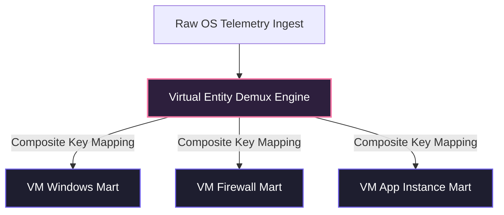

# Reclaiming the SOC: The Private VM Appliance Architecture for Autonomous, Zero-Ingestion SecOps

**A Technical White Paper on Enterprise-Grade Cybersecurity Architecture**  
*Published: May 27, 2026*  

---

## PAGE 1: THE SOC CRISIS & THE PRIVATE RECOVERY PARADIGM

### 1. Executive Summary: The Cloud Deception
For the past decade, enterprises have been pushed toward public cloud SIEM and SaaS security suites with the promise of infinite scalability and simplified management. However, the reality of modern security operations (SecOps) in the public cloud has become an unsustainable operational burden:
*   **The Ingestion Tax**: SIEM licensing models that charge per gigabyte of ingested data force organizations to discard high-volume, high-value telemetry (like network proxy and firewall logs) just to stay within budget.
*   **Compliance & Jurisdictional Nightmares**: In the wake of strict international frameworks like **DORA (Digital Operational Resilience Act)**, **GDPR**, and the **ECB (European Bank Guidelines)**, moving sensitive PII and financial operations data across cloud borders introduces massive regulatory risk, complex paperwork, and vendor lock-in.
*   **The Cloud Cost Anomaly**: Organizations face unpredictable public cloud egress, storage, and processing fees, driving a massive migration back toward private cloud infrastructure.

The **Private Unified SecOps VM Appliance** is a revolutionary, on-premises virtual appliance that natively consolidates **SIEM, SOAR, UEBA, TIP, XDR, Case Management, and Vulnerability Auditing** into a single, highly resilient, segmented environment. 

Inspired by the *Security Analytics Mesh (SAM)* philosophy, our architecture decouples **data storage from analysis costs**, enabling complete, zero-trust visibility without data ingestion taxes or compliance boundary risks.

---

### 2. Core Industry Pain Points vs. Our Private Solutions

| Legacy Cloud SIEM Pain Points | Our Private VM Appliance Solutions |
| :--- | :--- |
| **Exorbitant Ingestion Costs:** Pay-per-GB models force selective logging, leaving critical security blind spots. | **Zero-Ingestion Tax:** Data is collected locally via OpenTelemetry and stored in a high-performance ClickHouse core on your own private infrastructure. |
| **Data Jurisdiction & Compliance Risks:** Exporting telemetry containing PII to public clouds violates regional data residency rules. | **Strict Air-Gapped Residency:** The entire appliance runs in-house on Type 1 bare-metal hypervisors, fully isolating data from external jurisdictions. |
| **Pipeline & Rule Engineering Overload:** Heavy engineering is required to parse and rewrite custom telemetry logs continuously. | **Pluggable Data Marts & OOTB Schemas:** Ingestion routes directly into six provisioned-by-default, normalized technology marts (Legacy, Windows, Linux, Firewall, Proxy, Identity). |
| **Static Rules & Alert Fatigue:** Standard systems trigger hundreds of low-context alerts, dragging down analyst efficiency. | **Autonomous Security AI Agents:** An integrated, local AI agent automates alerts triage, performing deep contextual forensic investigations locally. |

---

### 3. The Segmented Appliance Boundary & Self-Auditing
The entire platform is delivered as a pre-packaged virtual appliance (**OVA/OVF** for VMware, **VHDX** for Hyper-V, and **QCOW2** for KVM) running on a hardened Linux OS. To enforce absolute Zero Trust Network Access (ZTNA), the appliance segregates traffic across **four dedicated virtual network interfaces (vNICs)** tied to isolated VLANs:

> [!IMPORTANT]
> *   **vNIC 0 (Ingestion - VLAN 100)**: Ingests inbound mTLS OTel telemetry. Isolated from console and control routes.
> *   **vNIC 1 (Control - VLAN 101)**: Dedicated to the Patch & Deployment server for secure, dual-signed gRPC agent upgrades.
> *   **vNIC 2 (Management - VLAN 102)**: Ephemerally serves the glassmorphism analyst Console UI and local AI APIs.
> *   **vNIC 3 (Storage - VLAN 103)**: An isolated network reserved for ClickHouse Keeper replication and Ceph data tiering.

Furthermore, satisfying strict **DORA / ECB self-auditability standards**, the appliance continuously **monitors its own operations (GUI & Non-GUI)**:
*   **GUI Auditing**: Captures all Web UI operations (Next.js admin console logins, dashboard exports, setting updates, and patch triggers).
*   **Non-GUI Auditing**: Logs all underlying SSH shells, root commands, `sudo` elevations, private ClickHouse database alterations, and container runtime states.

---

## PAGE 2: ARCHITECTURAL DEEP DIVE & OPERATIONAL WORKFLOWS

### 4. Pluggable Data Marts & Virtual Entity Demultiplexing
To address the real-world SIEM challenge of host log duplication—where a single physical server hosting multiple applications generates overlapping, confusing alerts—the platform introduces the **Virtual Entity Demultiplexing Engine**:

By generating a composite key: `[Hypervisor Type] + [Host VM UUID] + [Application Instance ID]`, the Lakehouse dynamically demultiplexes incoming telemetry. On the analyst's dashboard, a single virtual server hosting five separate applications (e.g., Workday, Oracle, Tanium, SQL, Autobahn) is represented as **five distinct, isolated Virtual Entity Nodes**. Detections, blast-radius maps, and SOAR playbooks target the specific virtual application node rather than flooding the host OS record.

---

### 5. The 8-Step Autonomous Security AI Agent Loop
Our architecture completely replaces the traditional, slow incident response cycle (`Alert → Analyst → Manual Investigation`) with an agentic autonomous loop running entirely on self-hosted local LLMs (Llama-3-8B / Mistral-7B) served in-house via GPU inference nodes:

1.  **Read Alert**: Automatically captures triggers across any active default or custom data mart.
2.  **Pull Logs**: Queries the surrounding historical logs across the segmented data marts to build correlation timelines.
3.  **Query Threat Intel**: Cross-references IOCs against the built-in, locally hosted Threat Intelligence Platform (TIP).
4.  **Check Identity & UEBA**: Reviews Active Directory status and audits baseline UEBA anomalies for the target accounts.
5.  **Correlate MITRE Mapping**: Maps host and process behaviors directly to MITRE ATT&CK techniques.
6.  **Summarize Blast Radius**: Evaluates exposure pathways, network topology, and compromised tokens to map exact exposure.
7.  **Recommend Containment**: Automatically generates targeted, granular containment recommendations.
8.  **Execute Playbook**: Executes local containment playbooks (e.g. host isolation via agents) instantly upon receiving **Analyst Approval**.

---

### 6. Tamper-Proof "Break-Glass" Emergency Protocol
Under critical recovery operations (e.g., physical host disconnects or total network outages), the platform utilizes a highly audited **"Break-Glass" Emergency Bypass**:
*   **Emergency Triggers**: Includes local recovery console logins (single-user root bypass), emergency patch overrides, and crisis unmasking of raw PII without supervisor validation.
*   **Immutable Local & Archive Logging**: The instant an override occurs, the system issues an **Extreme-Severity Alert** and records a tamper-proof audit trail (console ID, cryptographic key used, duration, and justified purpose) directly into an **immutable local event file** and streams it immediately to the secure **Module 4 cold storage Ceph array**.
*   **WORM Lock Enforcement**: Emergency logs are locked under a WORM (Write Once, Read Many) compliance policy and cannot be altered, bypassed, or deleted by any admin role.

---

### 7. Mythos-Class AI-Driven Vulnerability & Reachability Auditing
To counter the rapid speed of modern, AI-accelerated threats, the appliance incorporates **Mythos-class defensive AI auditing** running on the secure, local LLM container:
*   **Deep Zero-Day Discovery**: Analyzes configuration variables, file trees, and system dependencies dynamically, going beyond static CVE dictionary lookups to find hidden logic flaws and configuration drift.
*   **Reachability Assessment**: The local AI agent traces active process maps, open network channels, and active subnets to evaluate if a detected CVE is actually *reachable* and exploitable in the current environment context, dramatically filtering out false-positive noise.
*   **Proactive Mitigation Synthesis**: Once a reachable risk is validated, the AI agent autonomously synthesizes a targeted configuration hotfix or firewall rule and securely passes it to Module 3 for dual-signed patch deployment.

---

### 8. Zero-Ingestion 5-Year Cold Storage & In-Place Queries
A critical flaw of standard SIEMs is the requirement to retain years of logs for regulatory audits, incurring massive active database licensing costs. Our appliance resolves this via a **decoupled storage architecture**:
*   **180-Day Active Search**: ClickHouse maintains partitioned active indexes for rapid, sub-second search and dashboard queries.
*   **5-Year Cold Archive**: Partitions older than 180 days are automatically aged out, compressed into highly dense **Apache Parquet files**, and offloaded to local on-premises object storage (**Ceph / MinIO**) backed by WORM compliance locks.
*   **In-Place Federated Queries**: Analysts can run historical searches directly against the cold Parquet files using federated query engines (e.g., **DuckDB**) without undergoing the expensive, slow process of re-hydrating or migrating archives back into ClickHouse, enabling zero-migration, zero-ingestion-tax audits.

